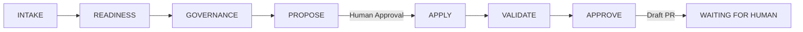

# Agentic Java Modernization Demo

Demonstrates AI-driven Java 8 → Java 17 modernization using GitHub Copilot as an **A2D (Acquire-to-Decommission) Modernization Agent**. An enterprise governance workflow — intake, risk scoring, compliance check, code changes, validation, and PR creation — is executed autonomously by the AI agent with human approval gates at every critical decision point.

---

## Table of Contents

- [Overview](#overview)
- [Prerequisites](#prerequisites)
- [Repository Structure](#repository-structure)
- [Setup Instructions](#setup-instructions)
- [Workshop Walkthrough (Step-by-Step)](#workshop-walkthrough-step-by-step)
  - [Part 1 — Explore the Legacy Monolith](#part-1--explore-the-legacy-monolith)
  - [Part 2 — Trigger the A2D Agent](#part-2--trigger-the-a2d-agent)
  - [Part 3 — Review the Assessment](#part-3--review-the-assessment)
  - [Part 4 — Approve and Apply](#part-4--approve-and-apply)
  - [Part 5 — Validate and Ship](#part-5--validate-and-ship)
- [The A2D Lifecycle (7 Stages)](#the-a2d-lifecycle-7-stages)
- [What the Agent Changes](#what-the-agent-changes)
- [Fallback Scripts (Offline Demo)](#fallback-scripts-offline-demo)
- [Demo Scenario — Introducing a Regression](#demo-scenario--introducing-a-regression)
- [Resetting the Demo](#resetting-the-demo)
- [Troubleshooting](#troubleshooting)

---

## Overview

This repo contains a deliberately simple **Java 8 monolith** with a single architectural flaw: `OrdersService` directly instantiates `BillingService` via `new BillingService()` — tight coupling with no interface, no dependency injection.

When you point GitHub Copilot (configured as the A2D Agent) at this repo, it will:

1. Scan and assess the repository (runtime, dependencies, coupling, security)
2. Score modernization readiness across 5 dimensions
3. Run a governance compliance check against an approved library registry
4. Propose minimum-scoped changes and wait for human approval
5. Apply the changes: Java 8 → 17, introduce an interface seam, add a Dockerfile
6. Validate: compile, test, dependency audit, Docker build & run
7. Push a branch and create a draft PR with full auditable evidence

**The agent never merges or deploys** — it always stops at "WAITING FOR HUMAN APPROVAL."

---

## Prerequisites

| Requirement | Version / Details | Check Command |
|---|---|---|
| **VS Code** | Latest stable | `code --version` |
| **GitHub Copilot extension** | Active subscription with Chat enabled | Extensions panel → search "GitHub Copilot" |
| **Java JDK** | 17+ (needed to compile the upgraded code) | `java -version` |
| **Maven** | Bundled via `mvnw` wrapper (no install needed) | `.\mvnw.cmd --version` |
| **Git** | 2.x+ | `git --version` |
| **GitHub CLI (`gh`)** | 2.x+ (authenticated) | `gh auth status` |
| **Docker Desktop** | Running (for container validation) | `docker info` |
| **GitHub repo access** | Push permissions to your fork/clone | `gh repo view` |

### One-time setup checklist

```powershell
# Verify Java 17+
java -version

# Verify GitHub CLI is authenticated
gh auth status

# Verify Docker is running
docker info

# Clone the repo (if not already done)
git clone https://github.com/<your-org>/agentic-java-modernization-demo.git
cd agentic-java-modernization-demo
```

---

## Repository Structure

```
.
├── .github/
│   └── copilot-instructions.md    # A2D Agent persona & workflow instructions
├── src/
│   ├── main/java/com/demo/
│   │   ├── Main.java              # Entry point
│   │   ├── billing/
│   │   │   └── BillingService.java    # Billing logic (tight-coupled target)
│   │   └── orders/
│   │       └── OrdersService.java     # Orders logic (has `new BillingService()`)
│   └── test/java/com/demo/orders/
│       └── OrdersBillingContractTest.java  # 4 contract tests
├── scripts/
│   ├── run-gates.cmd              # Maven gate runner (compile + test + diff)
│   ├── break-for-demo.sh          # Introduce deliberate test failure
│   ├── fix-for-demo.sh            # Revert the deliberate failure
│   └── fallback/                  # Echo-based scripts for offline demos
│       ├── a2d-intake.cmd
│       ├── a2d-readiness.cmd
│       ├── a2d-governance.cmd
│       ├── a2d-modernize.cmd
│       ├── a2d-approve.cmd
│       └── run-gates.cmd
├── evidence/                      # Generated assessment & approval artifacts
├── pom.xml                        # Maven build (Java 8 configured)
├── mvnw / mvnw.cmd               # Maven wrapper
└── README.md                      # This file
```

---

## Setup Instructions

### 1. Clone and open in VS Code

```powershell
git clone https://github.com/<your-org>/agentic-java-modernization-demo.git
cd agentic-java-modernization-demo
code .
```

### 2. Verify the monolith compiles and runs (Java 8 baseline)

```powershell
.\mvnw.cmd clean package -q
java -cp target\classes com.demo.Main
```

Expected output:
```
=== Orders Billing Monolith ===

OrdersService: placing order ORD-1001 for 249.99
BillingService: charged 249.99 for order ORD-1001 -> TXN-ORD-1001-<timestamp>
OrdersService: order ORD-1001 confirmed with transaction TXN-ORD-1001-<timestamp>
OrdersService: placing order ORD-1002 for 89.50
BillingService: charged 89.50 for order ORD-1002 -> TXN-ORD-1002-<timestamp>
OrdersService: order ORD-1002 confirmed with transaction TXN-ORD-1002-<timestamp>

All orders processed.
```

### 3. Verify tests pass

```powershell
.\mvnw.cmd test
```

Expected: `Tests run: 4, Failures: 0, Errors: 0`

### 4. Ensure GitHub Copilot is active

- Open the Copilot Chat panel (Ctrl+Shift+I or click the Copilot icon)
- Confirm you see the chat interface responding

---

## Workshop Walkthrough (Step-by-Step)

### Part 1 — Explore the Legacy Monolith

**Goal:** Understand the starting state before modernization.

1. Open [src/main/java/com/demo/orders/OrdersService.java](src/main/java/com/demo/orders/OrdersService.java)  
   - Notice line 11: `private final BillingService billingService = new BillingService();`  
   - This is the **tight coupling** the agent will fix.

2. Open [pom.xml](pom.xml)  
   - Notice: `<maven.compiler.source>1.8</maven.compiler.source>` — **Java 8, EOL since 2022.**

3. Run the app to see it work:
   ```powershell
   .\mvnw.cmd clean package -q
   java -cp target\classes com.demo.Main
   ```

4. Run tests to confirm green baseline:
   ```powershell
   .\mvnw.cmd test
   ```

### Part 2 — Trigger the A2D Agent

**Goal:** Initiate the autonomous modernization workflow.

1. Open **Copilot Chat** in VS Code

2. Ask Copilot to identify its role:
   > *"What are your instructions for this repo?"*
   
   Copilot should describe the A2D Modernization Agent persona and the 7-stage lifecycle.

3. Trigger the assessment:
   > *"A business request has arrived to modernize the Customer Ordering Service. Assess this repository."*

4. **Watch the agent work autonomously through stages 1–4:**
   - **INTAKE:** Scans pom.xml, source files, identifies Java 8 + tight coupling
   - **READINESS:** Scores across 5 dimensions, produces a percentage
   - **GOVERNANCE:** Checks all dependencies against approved registry
   - **PROPOSE:** Presents the change plan and **STOPS for approval**

### Part 3 — Review the Assessment

**Goal:** Review what the agent found before approving changes.

1. The agent saves its findings to `evidence/a2d-assessment.md` — review it.
2. Check the proposed changes:
   - Java 8 → 17 (pom.xml)
   - New `BillingClient` interface (decoupling seam)
   - `BillingService implements BillingClient`
   - `OrdersService` refactored to constructor injection
   - New Dockerfile with `eclipse-temurin:17-jre-alpine`
3. Verify: zero new runtime dependencies, zero business logic changes.

### Part 4 — Approve and Apply

**Goal:** Give the agent permission to make changes.

1. In Copilot Chat, type:
   > *"proceed"*

2. **The agent will:**
   - Create a feature branch (`modernize/java17-billing-seam`)
   - Apply all code changes
   - Commit with a descriptive message
   - Show the git diff

### Part 5 — Validate and Ship

**Goal:** Watch the agent validate its own work and create a PR.

1. The agent automatically runs:
   - `mvnw clean verify` — compilation + tests (should pass)
   - `mvnw dependency:tree` — confirms no new transitive deps
   - `docker build -t orders-service .` — builds the container
   - `docker run --name orders-demo orders-service` — runs and validates output

2. The agent pushes the branch and creates a **draft PR** on GitHub.

3. Review the PR at the link provided.

4. **(Optional)** Run the modernized app manually to verify:
   ```powershell
   java -cp target\classes com.demo.Main
   ```
   Output should be identical to the pre-upgrade run.

---

## The A2D Lifecycle (7 Stages)



| Stage | What Happens | Output |
|---|---|---|
| 1. INTAKE | Scans repo: runtime, deps, coupling, architecture | Risk assessment table |
| 2. READINESS | Scores 5 dimensions | Percentage + PROCEED/CAUTION/STOP |
| 3. GOVERNANCE | Checks approved registry, Dependabot CVEs | PASS / FAIL |
| 4. PROPOSE | Presents minimum-scoped changes | `evidence/a2d-assessment.md` + STOP |
| 5. APPLY | Creates branch, applies changes, commits | Git diff |
| 6. VALIDATE | Compile, test, dep check, Docker build & run | Gate results (PASS/FAIL) |
| 7. APPROVE | Pushes branch, creates draft PR | `evidence/approval-package.md` + PR link |

---

## What the Agent Changes

| File | Before | After |
|---|---|---|
| `pom.xml` | Java 1.8 | Java 17 |
| `BillingClient.java` | *(does not exist)* | New interface with `charge()` method |
| `BillingService.java` | Standalone class | `implements BillingClient` |
| `OrdersService.java` | `new BillingService()` (tight coupling) | Constructor injection via `BillingClient` |
| `Main.java` | `new OrdersService()` | `new OrdersService(new BillingService())` |
| `OrdersBillingContractTest.java` | `new OrdersService()` | `new OrdersService(new BillingService())` |
| `Dockerfile` | *(does not exist)* | Multi-stage build with `eclipse-temurin:17-jre-alpine` |

**Invariants maintained:**
- Zero new runtime dependencies
- Zero business logic changes
- All existing tests continue to pass
- Application output is identical

---

## Fallback Scripts (Offline Demo)

If GitHub Copilot is unavailable (network issues, rate limits), you can simulate the agent output using the echo-based fallback scripts:

```powershell
# Run each stage manually
scripts\fallback\a2d-intake.cmd
scripts\fallback\a2d-readiness.cmd
scripts\fallback\a2d-governance.cmd
scripts\fallback\a2d-modernize.cmd
scripts\fallback\a2d-approve.cmd
```

These produce formatted console output that mimics what the live agent displays.

---

## Demo Scenario — Introducing a Regression

To showcase the validation gates catching a problem:

```bash
# Introduce a deliberate bug (breaks zero-amount validation)
bash scripts/break-for-demo.sh

# Run tests — they will FAIL
.\mvnw.cmd test

# Fix the bug
bash scripts/fix-for-demo.sh

# Confirm tests pass again
.\mvnw.cmd test
```

This demonstrates that the gate (`mvnw test`) would block a broken PR.

---

## Resetting the Demo

To reset the repo to its original Java 8 state for another run:

```powershell
# Close any draft PRs
gh pr list --state open | ForEach-Object { gh pr close ($_ -split '\t')[0] --delete-branch }

# Switch to main and clean up
git checkout main
git branch -D modernize/java17-billing-seam 2>$null
git clean -fd evidence/
git checkout -- .

# Remove Docker artifacts
docker rm -f orders-demo 2>$null
docker rmi orders-service 2>$null

# Verify clean state
.\mvnw.cmd clean package -q
java -cp target\classes com.demo.Main
```

---

## Troubleshooting

| Problem | Solution |
|---|---|
| `mvnw.cmd` fails with permission error | Run `git update-index --chmod=+x mvnw` or use `mvnw.cmd` on Windows |
| Java version mismatch after upgrade | Ensure `JAVA_HOME` points to JDK 17+: `$env:JAVA_HOME` |
| Docker build fails | Ensure Docker Desktop is running: `docker info` |
| `gh pr create` fails with 404 | Check `gh auth status` and verify push permissions |
| Copilot doesn't follow A2D instructions | Ensure `.github/copilot-instructions.md` exists and VS Code has loaded the workspace |
| Agent adds unexpected files | Check that the workspace is clean: `git status` should show no uncommitted changes |
| Tests fail before any changes | Run `.\mvnw.cmd test` on `main` — if failing, run `bash scripts/fix-for-demo.sh` |
| Line ending issues in Docker | The Dockerfile includes `sed -i 's/\r$//' mvnw` to handle Windows CRLF |

---

## License

Internal demo — not for redistribution.
